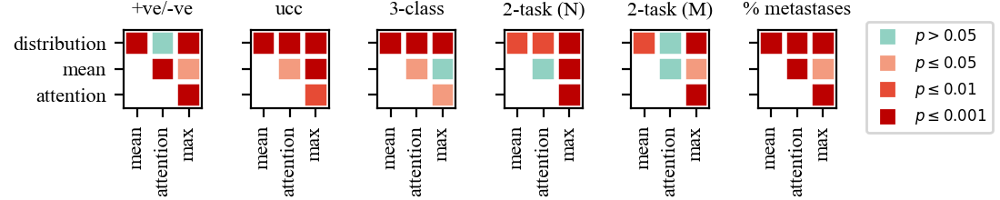

# MIL tasks on a digital histopathology image patches dataset

This part studies the effect of different MIL pooling filters on the performance of MIL models in different MIL tasks on a histopathology image patches dataset created from CAMELYON16 WSIs.

> We designed a neural network based MIL framework with 4 different MIL pooling filters:
* 'max'
* 'mean'
* 'attention'
* 'distribution'

> We also formulated 5 different MIL tasks:
1. Positive vs negative bag classification
2. Unique class count (ucc) classification
3. Multi-class classification
4. Multi-task classification
5. Regression

> For each task, we have a corresponding folder and the structure of the code in each folder is the same. Therefore, we will go through one of them only, yet it applies to all.

## Requirements

All the experiments were run in a virtual environment created with pip on a Linux machine. You can create a virtual environment and install the required packages.

To install requirements:

```setup
pip install -r requirements.txt
```

## Training

To train a model with a specific MIL pooling filter (e.g. 'distribution' pooling filter), run:

```train
python train.py --mil_pooling_filter "distribution"
```

> Some other hyper-parameters can also be passed to 'train.py' as '--key value' pairs. Please check 'train.py' for the full list of hyper-parameters. Also note that all hyper-parameters are set to the values used in the paper by default.

To run a full set of experiments with all 4 pooling filters in a task, run:

```shell
$ train.sh
```

## Evaluation

To test a model on the bags created from test set images, run:

```test
python test.py --mil_pooling_filter "distribution" --init_model_file "saved_models/state_dict__2020_12_01__13_13_18__500.pth"
```
> This will generate and test multiple bags for each image and save the results in 'test_metrics/2020_12_01__13_13_18__500/test' folder.

To obtain image level statistics, run:

```
python collect_statistics_over_bag_predictions.py --data_folder_path "test_metrics/2020_12_01__13_13_18__500/test"
```

To test full set of models with all 5 pooling filters and collect image level statistics in a task, run:

```shell
$ test.sh
```
> Note that this will test the models used in the paper. If you want to test your own models, go an update the script accordingly. Note that this script will run the statistical tests to compare the trained models as well.

## Dataset and Trained Models

The lymph node metastases dataset used in the paper and the trained models can be downloaded from [here](https://bit.ly/mil_pooling_filters).

For each task, trained models used in the paper are provided inside "saved_models" folder in the task folder.

## Results

Accuracy (for % metastases, absolute error) values of models with different MIL pooling filters in different MIL tasks are summarized in here:

|              | +ve/-ve | ucc     | 3-class | 2-task (N) | 2-task (M) | % metastases |
|--------------|---------|---------|---------|------------|------------|--------------|
| distribution | 0.8995  | 0.8832  | 0.7840  | 0.9144     | 0.8696     | 0.1558       |
| mean         | 0.8139  | 0.6413  | 0.6780  | 0.8913     | 0.8438     | 0.2426       |
| attention    | 0.8804  | 0.6957  | 0.7188  | 0.8927     | 0.8614     | 0.3264       |
| max          | 0.7636  | 0.7582  | 0.6712  | 0.8356     | 0.8111     | 0.2223       |


The p-values of the statistical tests to compare different models are also summarized as color-coded maps:



You can obtain the table and color-coded p-value maps by running "collect_results.sh" script in "collect results" folder. In order to do that, you must first run all 5 "test.sh" scripts in task folders successfully. Once you run "collect_results.sh", accuracy values will be stored in "collected_acc_values.txt" file and color-coded p-value maps will be in "color_coded_p_value_maps.png".

```shell
$ collect_results.sh
```

